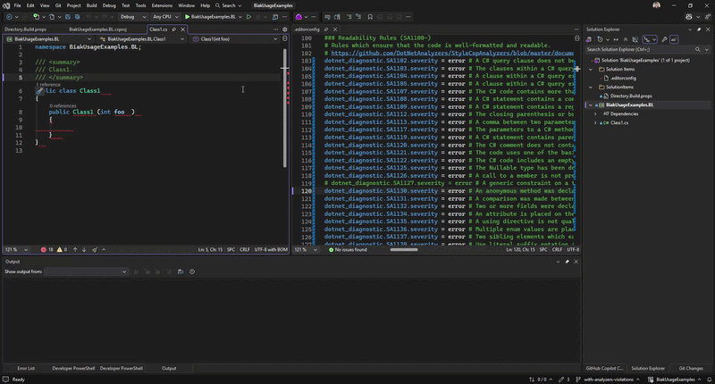
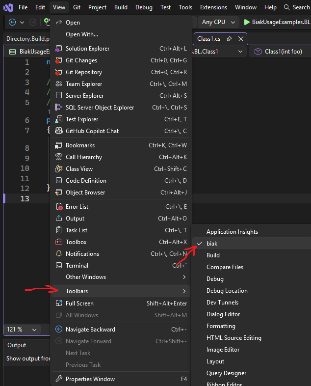
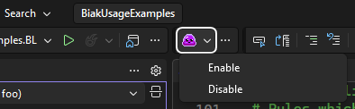

 

 
 
 
 
 

## 📙 Description
Visual Studio extension for [biak](https://github.com/kurnakovv/biak) tool 👁️🟣👁️

## 📺 Preview

<kbd></kbd>

## 🧩 Supported versions
* Visual Studio 2022
* Visual Studio 2026

## 🚀 Installation
1️⃣ Install [biak](https://github.com/kurnakovv/biak)

2️⃣ Install the extension via Visual Studio Marketplace or via [GitHub releases](https://github.com/kurnakovv/biak-visual-studio-extension/releases)

3️⃣ Visual Studio: `View` -> `Toolbars` -> `biak`

That's it - the extension is configured. Happy coding! 🚀

## ⭐ Give a star
I hope this extension is useful for you, if so, please give this repository a star, thank you :)
